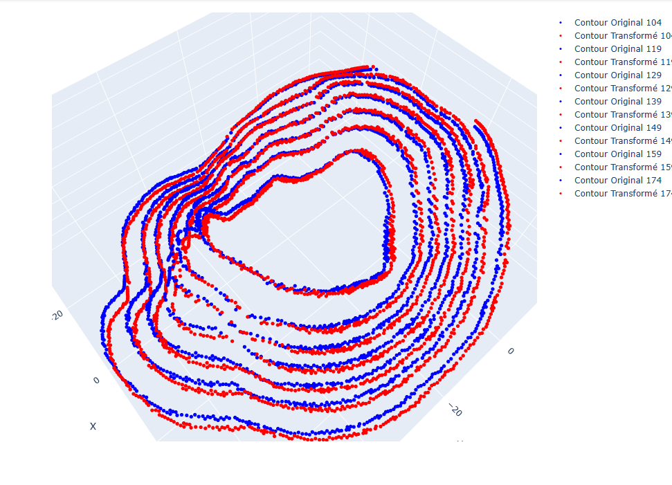

# Geodesic Potential Descriptors for Face Mesh Analysis

## Overview

This project focuses on developing **stable and robust global descriptors** based on the _méthode de potentiels géodésiques_ (geodesic potential method). These descriptors act as a **unique signature** for 3D and 4D facial meshes, enabling various advanced applications. By improving their accuracy and robustness, we aim to create descriptors that are invariant to pose, scale, and expression changes.

The ultimate goal is to utilize these descriptors as a **fingerprint-like representation** for tasks such as:

- **Sentiment Analysis**: Recognizing and classifying facial expressions linked to emotions.
- **Pattern Recognition**: Serving as general-purpose global descriptors for diverse tasks, such as shape matching, object recognition, and biometric identification.

The adaptability of these descriptors makes them suitable not only for facial expression analysis but also for a wide range of machine learning and pattern recognition applications.

---

## Repository Structure

The repository is structured to facilitate implementation, experimentation, and documentation:

'''
/src:               Main implementation code (Python, Matlab, etc.)
/docs:              Research papers, thesis references, and notes
/experimentations:  Notebooks and experimental scripts for testing and algorithms
/tests:             Scripts or tools for automated testing (empty for now)
/data:              Contains the mesh data + more (e.g., coordinates in `.txt` format)
/visuals-and-graphs: Plots, graphs, and visual results

---

## Visual Example: Geodesic Potentials and Level Sets

Below is an example Figure of a face mesh plot showcasing **level sets** derived from the **geodesic potential method**.

### Description:

- **Geodesic Potential Levels**:  
  The plot visualizes how the sum of geodesic distances to three fixed points generates concentric level curves. These curves are iterated by incrementing \( \mu \), forming a robust global representation of the mesh surface.

- **Utility**:  
  These level sets capture intrinsic shape information of the mesh, invariant to external transformations like scaling or rotation. As such, they form the foundation for computing stable global descriptors.

### Applications of the Visualized Method:

1. **Descriptor Calculation**:  
   Each level set contributes to the calculation of geodesic potential descriptors, which are invariant to deformations and pose changes.

2. **Facial Expression Analysis**:  
   These descriptors provide insight into subtle changes in facial expressions, enabling sentiment analysis.

3. **Pattern Recognition**:  
   The methodology extends beyond sentiment analysis, serving as a robust global descriptor for tasks like shape matching or biometrics.

---

## Goals

1. **Enhance Descriptor Stability**:  
   Improve the geodesic potential method for increased robustness and reliability.

2. **Expand Descriptor Utility**:  
   Develop descriptors capable of handling both sentiment analysis and other tasks like pattern recognition.

3. **Incorporate 4D Analysis**:  
   Extend the methodology to 4D meshes, integrating the time dimension for dynamic analysis.

---

## Applications

- **Emotion Recognition**:  
  Mapping 3D/4D face meshes to emotional states for sentiment classification.

- **Shape Analysis**:  
  Utilizing global descriptors for shape-based recognition tasks across multiple domains.

- **General AI Applications**:  
  Enabling efficient and accurate facial analysis for machine learning and AI-driven systems.

---

## Contributing

Contributions to enhance the methods, expand the dataset, or refine the implementation are welcome. Feel free to submit a pull request or open an issue for suggestions!
